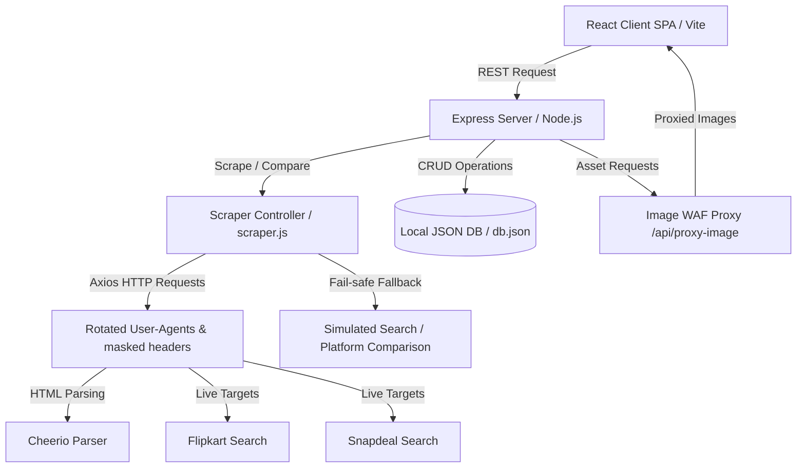

# 🛍️ Symbiote — Multi-Store Price Comparison Engine

Symbiote is a full-stack, real-time e-commerce price comparison engine built on **Express** and **React (Vite)**. It aggregates, scrapes, and compares product availability, pricing, shipping, and express delivery details across multiple retail categories (Electronics, Fashion, and Quick Commerce/Grocery) in real-time, helping users discover the best deals across platforms.

The application features rotating user agents, header masking, and image proxies to bypass modern Web Application Firewall (WAF) blockers, alongside simulated mock-up fallback engines for robust client-side demonstration when strict limits are hit.

---

## 📸 Core Features

- ⚡ **Live Comparative Feed**: Preloaded trending product arrays that automatically retrieve and compile side-by-side comparative pricing cards on the fly.
- 🏷️ **Multi-Store Category Routing**:
  - **E-Commerce**: Real-time comparisons across **Amazon India**, **Flipkart**, **Snapdeal**, **JioMart**, **Tata CLiQ**, **Meesho**, **Walmart**, **Croma**, and others.
  - **Fashion**: Tailored parsing filters for apparel across **Myntra**, **AJIO**, **Flipkart**, **Nykaa Fashion**, **Meesho**, and **Amazon**.
  - **Quick Commerce & Grocery**: Compares grocery items, express delivery margins, and packaging fees across **Blinkit**, **Zepto**, **Swiggy Instamart**, **BigBasket Now**, and **Flipkart Minutes**.
  - **Food Delivery**: Localized restaurant comparisons across **Zomato** and **Swiggy**.
- 🎯 **Best Deal Highlighter**: Automatically analyzes price structures across queried stores and highlights the cheapest merchant with a glowing success indicator.
- 🗺️ **GPS-Based Location Engine**:
  - Automatically requests HTML5 Geolocation coordinates on startup.
  - Resolves current coordinates to city names (Mumbai, Delhi, Bangalore) using OpenStreetMap Nominatim reverse lookup with custom bounding box fallbacks.
  - Updates shipping fees, delivery times, and restaurant parameters relative to the user's location.
- 📉 **Cheapest Cart Optimizer**:
  - Build custom grocery or food lists.
  - Searches for every item simultaneously across all relevant category channels.
  - Calculates subtotal, delivery charges, packaging fees, and taxes to highlight the overall cheapest store, detailing estimated savings.
- 🔔 **Saved Library & Price Alert Triggers**:
  - Save comparisons to a local persistent database.
  - Set custom target alert prices per product.
  - Dynamic pulse indicators warn users when a product drops below the target threshold.
- 📈 **Price History SVG Visualization**: Automatically generates synthetic 5-day price history graphs rendered dynamically as premium glowing SVG line charts with interactive coordinate indicators.
- 📁 **Multi-Format Catalog Export**: Download saved lists as custom formatted `.json` files, standard `.csv`, or a styled spreadsheet `.xlsx` branded with custom Flipkart blue (`#2874F0`) headers and auto-filters.
- 🎨 **Visual Themes**: Easily switch styles between **Cyberpunk Dark** (default), **Glassmorphic Light**, and **AMOLED Black** directly from the sidebar.

---

## 🛠️ System Architecture



### 1. Backend Engine (`/server`)
- **`server.js`**: Application entry point spinning up the HTTP server on port `5000` (or `process.env.PORT`).
- **`app.js`**: Defines middleware configurations (CORS, Express JSON parses), local static serving, image WAF proxies, and routes.
- **`scraper.js`**: The scraper backbone. Details extraction selectors for Flipkart/Snapdeal, manages rotating client headers, delays requests, computes price ranges, and hosts the fallback simulation catalog.
- **`db.js` & `db.json`**: Implements a simple file-system document database designed to safely handle serverless deployments (writing to `/tmp/db.json` when AWS lambda or similar variables are detected).

### 2. Frontend Components (`/src`)
- **`main.jsx`**: Bootstraps the React root application.
- **`App.jsx`**: Handles overall view routing, persistent local storage settings, themes, user geolocations, alerts tracking, and toast banners.
- **`components/Dashboard.jsx`**: Renders category navigation tabs, custom compared items, and pre-configured trending feeds. Includes a customized **Delivery Speed vs. Cost Tradeoff Matrix** (SVG scatter chart plotting stores based on cost and minutes).
- **`components/ScrapeConsole.jsx`**: Features a terminal console panel emulator displaying real-time scraping execution logs, progress bars, and catalog output tables.
- **`components/CartOptimizer.jsx`**: Renders the multi-store cart optimizer view, displaying comparative breakdowns including delivery fees.
- **`components/InsightHub.jsx`**: Aggregates catalog charts detailing price range distributions, ratings ratios, and discount margins.

---

## 🔒 WAF Bypass & Proxy Logic

E-commerce scrapers are highly vulnerable to Web Application Firewall (WAF) blocks (e.g. `403 Forbidden` errors on Flipkart). Symbiote uses several built-in bypass strategies:

1. **Header Isolation**: Specific headers like `Cache-Control` and `Upgrade-Insecure-Requests` are omitted from outbound requests to mimic authentic user sessions.
2. **Rotated User-Agents**: Requests cycle randomly through a pre-defined list of modern browser agent strings (Chrome, Safari, Firefox, Edge).
3. **Exponential Backoff**: When a search fails, the backend schedules up to 3 retries, scaling delays exponentially `(2^attempt * 1000 + random_jitter)` to reduce rate-limit detection.
4. **HTML Target Fallbacks**: Uses a fallback selector array to parse e-commerce cards regardless of dynamic class changes.
5. **Image Proxy Tunneling**: Flipkart and Snapdeal block hotlinked images. Outgoing product images are fetched by the Express backend (`/api/proxy-image`) using authentic referer headers (`https://www.flipkart.com/`) and piped directly to the client.
6. **Graceful Demo Mode**: If target retail connections time out or get blocked, the application serves synthesized comparative data, keeping the user interface functional.

---

## 🔌 API Reference

### 1. Trending Configuration
* **Endpoint**: `GET /api/trending`
* **Response**: Returns current trending items lists mapped under `ecommerce`, `quickcommerce`, and `food` categories.

### 2. Compare Prices
* **Endpoint**: `POST /api/compare`
* **Payload**:
  ```json
  {
    "query": "iphone 16",
    "category": "ecommerce",
    "location": "Mumbai"
  }
  ```
* **Response**: Real-time cross-store comparison object with cheap highlights.

### 3. Cart Optimization
* **Endpoint**: `POST /api/cart/optimize`
* **Payload**:
  ```json
  {
    "items": ["Milk", "Bread", "Eggs"],
    "location": "Delhi",
    "category": "quickcommerce"
  }
  ```
* **Response**: Optimization breakdown including delivery/packaging fees, pinpointing the cheapest source.

### 4. Bulk Scraping
* **Endpoint**: `POST /api/scrape`
* **Payload**:
  ```json
  {
    "query": "sneakers",
    "category": "ecommerce",
    "source": "all",
    "pages": 3,
    "location": "Mumbai"
  }
  ```
* **Response**: Catalog arrays scraped from target directories with detailed metadata logs.

### 5. Product Library CRUD
* **`GET /api/products`**: Fetch all saved products.
* **`POST /api/products`**: Save bulk scraped products (automatically maps 5-day historical variations).
* **`PUT /api/products/:id/alert`**: Modify target alert threshold (`targetPrice`).
* **`DELETE /api/products/:id`**: Remove a product from database.
* **`DELETE /api/products`**: Clear all saved products.

### 6. Analytics Dimensions
* **Endpoint**: `GET /api/analytics`
* **Response**: Numerical averages, store distribution percentages, price distributions, and rating counts.

### 7. File Exports
* **`GET /api/export/csv`**: Generates a standard CSV sheet of all saved products.
* **`GET /api/export/excel`**: Generates a stylized, branded `.xlsx` spreadsheet with filters.

### 8. Image Proxy
* **Endpoint**: `GET /api/proxy-image?url=<target_image_url>`
* **Response**: Streams target image directly, bypassing hotlink restrictions.

---

## 🚀 Getting Started

### Prerequisites
- [Node.js](https://nodejs.org/) (v18 or higher) installed on your system.

### One-Click Setup (Windows)
If you are on Windows, double-click **`Symbiote.lnk`** in the project folder. This shortcut executes `start_website.bat`, which:
1. Verifies local packages and runs `npm install` if `node_modules` is missing.
2. Starts the backend Express server and Vite frontend concurrently.
3. Automatically opens the client dashboard in your default browser at [http://localhost:5173](http://localhost:5173).

### Command Line Setup
1. **Install Dependencies**:
   ```bash
   npm run install:all
   ```
2. **Start Dev Server** (launches both Express backend and Vite client):
   ```bash
   npm run dev
   ```
   * **Client Frontend**: [http://localhost:5173](http://localhost:5173)
   * **Backend API**: [http://localhost:5000](http://localhost:5000)

---

## ☁️ Deployment Guide

Symbiote is configured to compile and serve compiled React files directly from the Express server in production. This enables hosting the entire project as a **single, unified serverless or containerized service** without requiring separate static servers.

### Steps to Deploy (Render, Heroku, Railway, etc.):
1. Link your deployment platform to the project's repository.
2. Configure these variables on the cloud platform:
   - **Build Command**: `npm run build`
   - **Start Command**: `npm start`
   - **Environment Variables**: Set `PORT` (automatically assigned by platforms).
3. The build process installs required dependencies, runs `vite build` (compiling files to `/dist`), and points Express to serve client assets from the compiled `/dist` directory.

---

## 📄 License

This project is licensed under the MIT License - see the [LICENSE](file:///e:/project/webscrapping/LICENSE) file for details.
