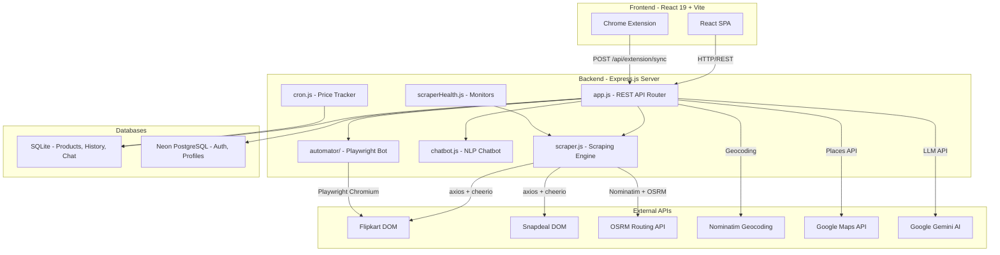

# Symbiote (FlipScrape) — Complete Backend Deep-Dive

> **Purpose:** Interview-preparation document. Every section is written so you can directly explain it to an interviewer.

---

## Table of Contents

1. [System Architecture Overview](#1-system-architecture-overview)
2. [How the Scraper Bypasses Website Blocking](#2-how-the-scraper-bypasses-website-blocking)
3. [How Results Are Fetched (Scraping Pipeline)](#3-how-results-are-fetched-scraping-pipeline)
4. [The Simulated Store Engine (Fallback System)](#4-the-simulated-store-engine-fallback-system)
5. [Branch-and-Bound Cart Optimization Algorithm](#5-branch-and-bound-cart-optimization-algorithm)
6. [Multi-Store Price Comparison Engine](#6-multi-store-price-comparison-engine)
7. [Cab Fare Comparison Algorithm](#7-cab-fare-comparison-algorithm)
8. [AI Chatbot — Rule-Based NLP Engine](#8-ai-chatbot--rule-based-nlp-engine)
9. [Gemini AI Integration with Local NLP Fallback](#9-gemini-ai-integration-with-local-nlp-fallback)
10. [Voice-to-Cart NLP Parser](#10-voice-to-cart-nlp-parser)
11. [Profile-Aware Discount Engine](#11-profile-aware-discount-engine)
12. [Authentication & Security](#12-authentication--security)
13. [Database Architecture](#13-database-architecture)
14. [Price History Cron Scheduler](#14-price-history-cron-scheduler)
15. [Scraper Health Monitoring System](#15-scraper-health-monitoring-system)
16. [Image Proxy — Bypassing CDN Hotlink Protection](#16-image-proxy--bypassing-cdn-hotlink-protection)
17. [Playwright Order Automator](#17-playwright-order-automator)
18. [AES-256-GCM Credential Encryption](#18-aes-256-gcm-credential-encryption)
19. [Chrome Extension Pipeline](#19-chrome-extension-pipeline)
20. [Location & Geospatial Services](#20-location--geospatial-services)
21. [Store Niche Validator Algorithm](#21-store-niche-validator-algorithm)
22. [Data Export Engine (CSV & Excel)](#22-data-export-engine-csv--excel)
23. [Product Analytics Engine](#23-product-analytics-engine)
24. [Complete API Endpoint Reference](#24-complete-api-endpoint-reference)
25. [Tech Stack Summary](#25-tech-stack-summary)

---

## 1. System Architecture Overview



The backend is a **monolithic Node.js Express server** that acts as an API gateway, scraping engine, background job runner, and AI chatbot all in one process. It uses a **dual-database strategy**: SQLite for high-speed local data (products, price history, chat logs) and Neon PostgreSQL for cloud-based authentication and user profiles.

---

## 2. How the Scraper Bypasses Website Blocking

This is the most interview-critical section. E-commerce sites employ multiple layers of bot detection. Here is exactly how each layer is bypassed:

### 2.1 User-Agent Rotation

**Problem:** If a server sees 1000 requests from the same browser fingerprint, it blocks the IP.

**Solution:** A pool of 7 real-world User-Agent strings is maintained (Chrome, Firefox, Safari, Edge on Windows, Mac, and Linux). The `getRandomUserAgent()` function randomly picks one **per request**.

```javascript
const USER_AGENTS = [
  'Mozilla/5.0 (Windows NT 10.0; Win64; x64) AppleWebKit/537.36 ... Chrome/125.0.0.0 Safari/537.36',
  'Mozilla/5.0 (Macintosh; Intel Mac OS X 14_5) AppleWebKit/605.1.15 ... Safari/605.1.15',
  // ... 7 total agents
];
function getRandomUserAgent() {
  return USER_AGENTS[Math.floor(Math.random() * USER_AGENTS.length)];
}
```

> **Interview Talking Point:** "We rotate User-Agents to prevent browser fingerprint clustering, which is the #1 trigger for WAF-level IP bans."

### 2.2 HTTP Header Spoofing & Selective Stripping

**Problem:** Bots send different headers than browsers. WAFs (Web Application Firewalls) like Cloudflare and Akamai inspect header combinations.

**Solution:** The `getHeaders()` function sets realistic `Accept`, `Accept-Language`, and `Accept-Encoding` headers **but intentionally omits** `Cache-Control` and `Upgrade-Insecure-Requests`. The code comment explicitly states this was removed to avoid `403 Forbidden` blocks.

```javascript
function getHeaders() {
  return {
    'User-Agent': getRandomUserAgent(),
    'Accept': 'text/html,application/xhtml+xml,...',
    'Accept-Language': 'en-US,en;q=0.9,hi;q=0.8',
    'Accept-Encoding': 'gzip, deflate, br',
    'Connection': 'keep-alive'
    // NOTE: Removed 'Cache-Control' and 'Upgrade-Insecure-Requests' to avoid 403 blocks.
  };
}
```

> **Interview Talking Point:** "We discovered through trial and error that sending `Cache-Control` headers triggered Flipkart's WAF. By stripping those specific headers while keeping realistic `Accept` chains, we mimic a standard browser request."

### 2.3 Jittered Exponential Backoff with Retry

**Problem:** Even with valid headers, rapid-fire requests trigger rate limiting (HTTP 429).

**Solution:** The `fetchWithRetry()` function implements **exponential backoff** with a random jitter:

```
Wait time = 2^attempt × 1000ms + random(0–1000ms)
```

- Attempt 1 fails → wait ~2–3 seconds
- Attempt 2 fails → wait ~4–5 seconds  
- Attempt 3 fails → throw final error

The random jitter prevents the **thundering herd problem** — without it, retry intervals would be mathematically predictable, which is exactly how bot traffic looks vs. human traffic.

```javascript
async function fetchWithRetry(url, maxRetries = 3) {
  for (let attempt = 1; attempt <= maxRetries; attempt++) {
    try {
      const response = await axios.get(url, { headers: getHeaders(), timeout: 10000 });
      return response;
    } catch (error) {
      if (attempt === maxRetries) throw new Error(`Failed after ${maxRetries} attempts`);
      const backoff = Math.pow(2, attempt) * 1000 + Math.random() * 1000;
      await new Promise(r => setTimeout(r, backoff));
    }
  }
}
```

### 2.4 Adaptive CSS Selector Fallback Chains

**Problem:** Sites frequently change their CSS class names to break scrapers (Flipkart does this almost weekly).

**Solution:** Instead of relying on a single CSS selector, every extraction function accepts an **array of selectors** and iterates through them:

```javascript
function extractText($, el, selectors) {
  for (const selector of selectors) {
    const found = $(el).find(selector);
    if (found.length > 0) {
      const text = found.first().text().trim();
      if (text) return text;
    }
  }
  return null;
}

// Usage — price extraction tries 3 different class names:
const price = cleanPrice(extractText($, el, ['.hZ3P6w', '.Nx9bqj', '._30jeq3']));
```

> **Interview Talking Point:** "Our selector chains act as a version-tolerant parser. When Flipkart renames `.Nx9bqj` to `.hZ3P6w` in a UI update, our scraper doesn't break because it tries the old selector as a fallback."

### 2.5 Product Card Auto-Detection

The scraper doesn't hardcode a single product card selector. It tries **6 different container patterns** and uses whichever matches:

```javascript
const productCardSelectors = [
  'div[data-id]',           // Data attribute based
  'div._1AtVbE div._13ber2', // Legacy Flipkart layout
  'div._1xHGtK._373qXS',    // Grid layout
  'div._2kHMtA',             // Card layout variant
  'div.tUxRFH',              // New 2024 layout
  'div.slAVV4'               // Latest 2025 layout
];
```

### 2.6 Playwright Automation — Bypassing `navigator.webdriver`

For the **Order Automator** (which actually logs in and interacts with Amazon/Flipkart), simple HTTP requests aren't enough. It needs a real browser:

```javascript
const browser = await chromium.launch({
  headless: true,
  args: [
    '--no-sandbox',
    '--disable-setuid-sandbox',
    '--disable-blink-features=AutomationControlled'  // ← KEY LINE
  ]
});
```

**`--disable-blink-features=AutomationControlled`** is the critical flag. By default, headless Chromium sets `navigator.webdriver = true`, which Amazon's JavaScript immediately checks. This flag strips that property.

Additionally, the browser context is configured with an Indian fingerprint:
- **Locale:** `en-IN`
- **Timezone:** `Asia/Kolkata`  
- **Viewport:** 1280×900 (standard desktop)
- **User-Agent:** Realistic Chrome 125 string

### 2.7 CAPTCHA/OTP Graceful Yielding

When Amazon detects the bot despite all evasion (OTP, CAPTCHA, 2FA), the automator **does not crash**. It detects this by checking the URL:

```javascript
if (currentUrl.includes('ap/cvf') || currentUrl.includes('ap/mfa') || currentUrl.includes('ap/challenge')) {
  return { status: 'needs_otp', message: 'OTP or CAPTCHA required.' };
}
```

It takes a screenshot, updates the session status, and hands control back to the user.

### 2.8 Image Proxy — Bypassing CDN Hotlink Protection

E-commerce CDNs block image requests that don't come from their own domain (hotlink protection). The `/api/proxy-image` endpoint acts as a **reverse proxy**:

```javascript
app.get('/api/proxy-image', async (req, res) => {
  const response = await axios.get(decodedUrl, {
    responseType: 'arraybuffer',
    headers: {
      'User-Agent': getRandomUserAgent(),
      'Referer': decodedUrl.includes('flipkart') 
        ? 'https://www.flipkart.com/'  // ← Spoofs the Referer header
        : 'https://www.snapdeal.com/',
    }
  });
  res.setHeader('Cache-Control', 'public, max-age=86400'); // 24h cache
  res.send(Buffer.from(response.data));
});
```

> **Interview Talking Point:** "We spoof the `Referer` header to match the origin domain, making the CDN think the image is being loaded from their own product page."

---

## 3. How Results Are Fetched (Scraping Pipeline)

### 3.1 Flipkart Live Scraper

1. Constructs the search URL: `https://www.flipkart.com/search?q=<query>&page=<n>`
2. Fetches HTML via `fetchWithRetry()` (with all bypass headers)
3. Loads HTML into **Cheerio** (a server-side jQuery-like DOM parser)
4. Iterates through auto-detected product card containers (up to 15 per page)
5. Extracts: name, price, original price, discount, rating, review counts, product link, image URL
6. Cleans raw text using helper functions:
   - `cleanPrice()` — strips `₹`, `,`, `Rs.` → returns a float
   - `cleanRating()` — extracts decimal from strings like "4.3 out of 5"
   - `cleanReviewCount()` — parses "1,234 Ratings & 567 Reviews" into `{ ratings: 1234, reviews: 567 }`
   - `cleanDiscount()` — extracts integer from "23% off"
7. Returns a normalized product array with unique IDs

### 3.2 Snapdeal Live Scraper

Same pipeline, but with Snapdeal-specific selectors (`.product-tuple-listing`, `.product-title`, `.product-price`). Snapdeal's rating uses a CSS `width` percentage for star fill, which is extracted via regex:

```javascript
const widthStr = $(el).find('.rating-stars .filled-stars').attr('style');
const ratingMatch = widthStr ? widthStr.match(/width:\s*([\d.]+)%/) : null;
const rating = ratingMatch ? parseFloat((parseFloat(ratingMatch[1]) / 20).toFixed(1)) : null;
// 100% width = 5 stars, so divide by 20
```

### 3.3 Deduplication

After scraping, products are deduplicated using a `Set` keyed by `{source}-{name.toLowerCase()}`:

```javascript
const seen = new Set();
const uniqueProducts = products.filter(p => {
  const key = `${p.source}-${p.name.toLowerCase().trim()}`;
  if (seen.has(key)) return false;
  seen.add(key);
  return true;
});
```

---

## 4. The Simulated Store Engine (Fallback System)

For the 180+ stores that can't be live-scraped (Amazon, Myntra, Blinkit, Zomato, etc.), the system uses a **deterministic simulation engine** that generates realistic, market-rate product data.

### 4.1 Market Price Estimation Algorithm

The `getEstimatedBasePrice()` function uses a **priority-ordered keyword matching system**:

1. **Exact product matches first** — "iPhone 16" → ₹67,900; "AirPods Pro" → ₹18,900
2. **Generic category fallbacks** — Quick commerce items default to ₹120; fashion items to ₹2,400
3. **Product-type heuristics** — phones → ₹24,999; laptops → ₹54,999; headphones → ₹2,999

### 4.2 Competitive Price Variation

For each store, the base price is multiplied by a position-dependent factor to simulate realistic competition:

```javascript
for (let i = 0; i < itemCount; i++) {
  const priceMultiplier = 0.85 + (i * 0.05) + Math.random() * 0.05;
  const price = Math.round(basePrice * priceMultiplier);
  // Item 0: ~85% of base (cheapest)
  // Item 5: ~110% of base (pricier option)
}
```

### 4.3 Location-Aware Delivery Profiles

The `getDeliveryProfile()` function adjusts delivery times and fees based on the user's **city tier**:

| Tier | Examples | E-commerce Delivery | QC Delivery | Delivery Fee |
|------|----------|-------------------|------------|-------------|
| Metro | Mumbai, Delhi, Bangalore | 2-3 days | 7-15 mins | ₹0 |
| Tier-2 | Indore, Chandigarh, Kochi | 3-5 days | +5 mins | ₹20-40 |
| Tier-3 | Any valid 6-digit pincode | 5-7 days | +15 mins | ₹35-60 |
| Rural | No pincode match | 7-10 days | Not available | ₹80 |

### 4.4 Store Niche Validation

Before showing results, `doesStoreSellQuery()` validates if a store logically sells the queried product. This uses **12 groups** with regex-based category detection:

- `isFootwear` → `/\b(shoe|sneaker|sandal|boot|flats|heels)\b/`
- `isElectronics` → `/\b(laptop|phone|tv|earphone|smartwatch|speaker)\b/`
- `isJewelry` → `/\b(ring|necklace|earring|gold|diamond|bracelet)\b/`
- etc.

If you search "iPhone" on Lenskart, it returns empty. If you search "sunglasses" on Lenskart, it returns results.

---

## 5. Branch-and-Bound Cart Optimization Algorithm

**Location:** `/api/cart/optimize` endpoint in `app.js`

**The Problem:** Given N items and M stores (each with different prices + delivery fees), find the cheapest way to buy all items. This could be from a single store, or by splitting the cart across multiple stores.

**Complexity:** Brute force is O(M^N). For 10 items across 5 stores = 9.7 million combinations.

### 5.1 Algorithm Walkthrough

```
solve(itemIdx, currentItemCost, usedStoresSet, currentAssignments)
```

**Step 1 — Initialization:**
- Calculate the cheapest single-store total as the initial upper bound (`bestTotal`)
- Each store's overhead = `deliveryFee + packagingFee`

**Step 2 — Recursive Exploration:**
For each item, try assigning it to every store:

```
For item[0]:
  Try store A → cost = ₹50, overhead = ₹30 (new store)
    For item[1]:
      Try store A → cost = ₹50+₹40 = ₹90, overhead = ₹30 (same store, no new overhead)
      Try store B → cost = ₹50+₹35 = ₹85, overhead = ₹30+₹25 = ₹55
        PRUNE if ₹85 + ₹55 >= bestTotal (₹150) → continue
  Try store B → ...
```

**Step 3 — Pruning (the "Bound" in Branch-and-Bound):**
Before recursing deeper, calculate:
```
lowerBound = currentItemCost + price + currentOverhead + addedOverhead
```
If `lowerBound >= bestTotal`, **prune the entire branch**. This eliminates millions of combinations.

**Step 4 — Timeout Safety:**
A 2-second `SOLVE_TIMEOUT_MS` prevents server hangs on massive carts.

**Step 5 — Result:**
The algorithm returns a `splitCart` object showing which items go to which stores, with per-store breakdowns.

> **Interview Formula:** "The time complexity is O(M^N) in the worst case, but Branch-and-Bound pruning brings the practical runtime down to milliseconds for typical carts of 5-15 items."

---

## 6. Multi-Store Price Comparison Engine

**Location:** `compareProductPrices()` in `scraper.js`

### 6.1 Smart Store Selection

Instead of comparing across all 180+ stores, the engine selects **relevant stores** based on the query category:

| Query Type | Detected By | Stores Selected |
|------------|-------------|-----------------|
| Fashion | "shoe", "dress", "jeans" | Myntra, AJIO, Zara, Puma, H&M + 50 more |
| Electronics | "phone", "laptop", "tv" | Amazon, Flipkart, Croma, Samsung, boAt + 20 more |
| Jewelry | "gold", "diamond", "ring" | Tanishq, CaratLane, BlueStone + 15 more |
| Grocery | "milk", "bread" | Blinkit, Zepto, Instamart, BigBasket |
| Food | "pizza", "biryani" | Zomato, Swiggy |

If more than 15 stores are selected, it keeps **priority stores** (Amazon, Flipkart, etc.) and randomly samples the rest to prevent response bloat.

### 6.2 In-Memory TTL Cache

Results are cached for 5 minutes using a `Map`:

```javascript
const priceCache = new Map();
const CACHE_TTL = 5 * 60 * 1000;

const cacheKey = `${query}-${category}-${location}`;
if (priceCache.has(cacheKey)) {
  const cached = priceCache.get(cacheKey);
  if (Date.now() - cached.timestamp < CACHE_TTL) {
    return cached.data; // Cache hit
  }
}
```

### 6.3 Profile-URL Member Discounts

If the user has connected their store profile URLs, matched stores get a 10% discount:

```javascript
matchedStores.forEach(matchedStore => {
  storeData.price = Math.floor(storeData.price * 0.9); // 10% member discount
  storeData.sourceMode = 'live-profile'; // Indicate highly accurate mode
});
```

---

## 7. Cab Fare Comparison Algorithm

**Location:** `compareCabFares()` in `scraper.js`

This is a full ride-hailing fare simulator supporting **7 platforms** (Uber, Ola, Rapido, inDrive, BluSmart, Namma Yatri, Meru) with **24 ride types**.

### 7.1 Real-Time Route Estimation

Uses a **3-step geocoding pipeline**:
1. **Geocode pickup** via Nominatim (OSM): `"Bandra" → lat: 19.054, lng: 72.840`
2. **Geocode drop** via Nominatim
3. **Calculate real driving route** via **OSRM** (Open Source Routing Machine): returns actual road distance and driving duration

Falls back to a **known-routes lookup table** if OSRM fails (pre-mapped city-specific routes like "Airport → Bandra = 12km, 35min").

### 7.2 Fare Calculation Formula

```
Fare = max(minFare, (baseFare × cityMultiplier + perKm × distance × cityMultiplier + perMin × duration) × surgeMultiplier × congestionMultiplier × jitter)
```

Where:
- **cityMultiplier**: Mumbai = 1.15×, Kolkata = 0.85×, Jaipur = 0.8×
- **surgeMultiplier**: Peak hours (8-10am, 5-9pm) = 1.0×–1.8×; Late night = 1.2×–1.7×; Off-peak = 1.0×–1.2×
- **congestionMultiplier**: Based on `duration / expectedDuration` ratio — Heavy Traffic > 1.45× = 1.25× fare boost
- **jitter**: ±4% random variation to simulate real-world fare randomness

### 7.3 Context-Aware Ride Availability

```javascript
function isRideAvailableAtLocation(rideCategory, pickup, drop, city) {
  // Highway → no bikes or autos
  // Airport in Mumbai/Delhi → no autos
  // Late night (11pm-5am) → 50% chance bikes unavailable
  // Narrow areas (old city, dharavi, chawl) → no SUVs
}
```

### 7.4 Deep Link Generation

Each platform result includes a **booking deep link** that opens the actual app/website with the pickup and drop pre-filled:

```javascript
// Uber: https://m.uber.com/ul/?action=setPickup&pickup[formatted_address]=Bandra...&dropoff[0][formatted_address]=Andheri...
// Ola: https://book.olacabs.com/?pickup=Bandra...&drop=Andheri...
```

---

## 8. AI Chatbot — Rule-Based NLP Engine

**Location:** `chatbot.js`

### 8.1 Intent Classification Algorithm

The chatbot uses a **weighted scoring system** to classify user messages into 15+ intents:

```
For each intent:
  Score = 0
  
  1. Regex pattern match → +10 points (e.g., /\b(bug|broken|not\s?work)\b/i)
  2. Keyword containment → +3 + (keyword.length × 0.5) points
     (longer keywords = more specific = higher weight)
  3. Priority boost → +intent.priority (1-4)
  
  Highest scoring intent wins. If all scores = 0, fallback.
```

> **Interview Talking Point:** "We use keyword length as a scoring weight because longer keywords like 'cart optimizer' are more specific than short words like 'cart', reducing false positives."

### 8.2 Multi-Turn Conversation State Machine

The chatbot maintains a `feedbackPending` state per session:

```
State: null → User says "I found a bug"
  → Classify: feedback_bug (score: 10 + 3 + 4 = 17)
  → Set state: { category: 'bug', awaitingMessage: true }
  → Response: "Please describe the bug..."

State: awaitingMessage → User types "The search doesn't load"
  → Don't classify — intercept in state handler
  → Save message, set awaitingRating: true
  → Response: "Would you like to give a star rating?"

State: awaitingRating → User types "4"
  → Extract rating via regex /\b([1-5])\s*(?:star)?/i
  → Save feedback: { category: 'bug', message: '...', rating: 4 }
  → Clear state, return to normal
```

### 8.3 Session Cleanup

Sessions are stored in an in-memory `Map` with a 30-minute TTL. A `setInterval` every 5 minutes purges stale sessions.

---

## 9. Gemini AI Integration with Local NLP Fallback

**Location:** `/api/ai/analyze` endpoint in `app.js`

### 9.1 Primary: Google Gemini 1.5 Flash

```javascript
const response = await axios.post(
  `https://generativelanguage.googleapis.com/v1beta/models/gemini-1.5-flash:generateContent?key=${apiKey}`,
  { contents: [{ parts: [{ text: prompt }] }] },
  { timeout: 8000 }
);
```

The prompt instructs Gemini to act as a "Symbiote Value Analyst" and analyze the cart data JSON to recommend the best store.

### 9.2 Fallback: Local Rule-Based NLP Analyst

If Gemini fails (no API key, timeout, rate limit), a local template engine generates the analysis:

```javascript
analysis = `Based on our Smart Value analysis, **${cheapestStoreName}** offers the best 
single-store value, bringing your total to **₹${cheapestTotal}**. 
${splitCart ? `By splitting across ${storesStr}, save an extra ₹${splitCart.savings}.` : ''}`;
```

> **Interview Talking Point:** "We implement a primary-with-fallback pattern so the app never shows a blank state. If the Gemini API is down or the free tier is exhausted, the user still gets a useful recommendation."

---

## 10. Voice-to-Cart NLP Parser

**Location:** `/api/ai/parse-voice` endpoint

Converts speech transcription like *"Add milk, bread, and eggs to cart"* into structured data.

### 10.1 Primary: Gemini-Powered Extraction

Sends the transcription to Gemini with a prompt to return `{ items: [...], category: "quickcommerce" }`.

### 10.2 Fallback: Regex-Based Local Parser

```javascript
// 1. Detect category via keyword regex
if (/\b(pizza|burger|biryani|zomato|swiggy)\b/.test(text)) category = 'food';
else if (/\b(phone|laptop|flipkart|amazon)\b/.test(text)) category = 'ecommerce';

// 2. Extract the item list portion
const match = text.match(/(?:search for|add|buy|get|need)\s+(.+)/i);

// 3. Split on "and", "or", commas
const rawItems = listPart.split(/\band\b|,|\bor\b/);

// 4. Clean filler words ("a", "the", "packs of", "kg", "to cart")
items = rawItems.map(item => item
  .replace(/\b(a|an|the|some|please|packs? of|kgs?|litres?)\b/g, '')
  .replace(/\b\d+\s*\b/g, '') // remove numbers
  .trim()
).filter(item => item.length > 2);
```

---

## 11. Profile-Aware Discount Engine

**Location:** `applyProfileDiscounts()` in `scraper.js`

This is a post-processing layer that adjusts scraped prices based on the user's **memberships** and **bank cards**.

### 11.1 Membership Rules

| Membership | Eligible Stores | Benefit |
|-----------|----------------|---------|
| Amazon Prime | Amazon, Amazon Fresh | Free delivery |
| Flipkart Plus | Flipkart, FK Minutes, Shopsy | Free delivery |
| Zomato Gold | Zomato | Free delivery + 15% off |
| Swiggy One | Swiggy, Instamart | Free delivery + 10% off |
| Blinkit Pass | Blinkit | Free delivery |

### 11.2 Bank Card Offers (Best-Card-Only, No Stacking)

The algorithm iterates through all user cards, calculates the discount each would give (capped by `maxDiscount`), and applies **only the single best card**:

```javascript
for (const cardName of bankCards) {
  const rawDiscount = Math.round(effectivePrice * offer.discountPct / 100);
  const cappedDiscount = Math.min(rawDiscount, offer.maxDiscount);
  if (cappedDiscount > bestBankSaving) {
    bestBankSaving = cappedDiscount;
    bestBankLabel = `${offer.discountPct}% Off (${cardName} Card, max ₹${offer.maxDiscount})`;
  }
}
```

Supported banks: HDFC (10%, max ₹1500), ICICI (10%, max ₹1250), SBI (7.5%), Axis (5%, Flipkart/Myntra only), Kotak (5%, Amazon only), AMEX (10%, Amazon/Flipkart), and 8 more.

---

## 12. Authentication & Security

### 12.1 JWT-Based Authentication

```javascript
function generateToken(user) {
  return jwt.sign(
    { userId: user.id, email: user.email },
    JWT_SECRET,
    { expiresIn: '30d' }
  );
}
```

### 12.2 verifyUser Middleware

Every request passes through this middleware. It extracts the JWT from the `Authorization: Bearer <token>` header, verifies it, and attaches `req.userId`. If invalid, it falls back to `'anonymous'` (graceful degradation, not a hard block).

### 12.3 Password Hashing

Uses **bcrypt** with **10 salt rounds** via `bcryptjs`:
```javascript
const passwordHash = await bcrypt.hash(password, 10);
const isValid = await bcrypt.compare(password, user.password_hash);
```

---

## 13. Database Architecture

### 13.1 SQLite Schema (Local)

```sql
-- Products with user isolation
CREATE TABLE products (
  id TEXT PRIMARY KEY,
  query TEXT, category TEXT, store TEXT, title TEXT,
  price REAL, original_price REAL, discount TEXT,
  rating TEXT, image TEXT, url TEXT,
  location TEXT, pincode TEXT, target_price REAL,
  user_id TEXT DEFAULT 'anonymous',
  created_at DATETIME, updated_at DATETIME
);

-- Price tracking over time
CREATE TABLE price_history (
  id INTEGER PRIMARY KEY AUTOINCREMENT,
  product_id TEXT REFERENCES products(id) ON DELETE CASCADE,
  price REAL,
  recorded_at DATETIME DEFAULT CURRENT_TIMESTAMP
);

-- Chatbot messages
CREATE TABLE chat_messages (
  session_id TEXT, role TEXT CHECK(role IN ('user','assistant')),
  content TEXT, user_id TEXT
);

-- Structured user feedback
CREATE TABLE feedback (
  category TEXT CHECK(category IN ('bug','feature','improvement','general')),
  message TEXT, rating INTEGER CHECK(rating BETWEEN 1 AND 5),
  page TEXT, user_id TEXT
);

-- Scraper uptime tracking
CREATE TABLE scraper_health (
  store TEXT UNIQUE,
  status TEXT CHECK(status IN ('healthy','degraded','dead')),
  success_rate REAL
);
```

**Key Design Decision — WAL Mode:**
```javascript
db.pragma('journal_mode = WAL');
```
WAL (Write-Ahead Logging) allows concurrent readers and writers. Without it, the cron job updating prices would lock out API read requests.

### 13.2 Synthetic Price History Seeding

When a product is first saved, the system pre-populates 7 days of price history with realistic fluctuations (±4% from base price):

```javascript
for (let i = 6; i >= 0; i--) {
  const fluctuation = 0.96 + Math.random() * 0.08; // -4% to +4%
  const histPrice = i === 0 ? basePrice : Math.round(basePrice * fluctuation);
  // Insert with backdated timestamp
}
```

### 13.3 Neon PostgreSQL Schema (Cloud)

```sql
CREATE TABLE users (
  id UUID PRIMARY KEY DEFAULT gen_random_uuid(),
  email TEXT UNIQUE NOT NULL,
  password_hash TEXT NOT NULL,
  full_name TEXT DEFAULT ''
);

CREATE TABLE user_preferences (
  user_id UUID PRIMARY KEY REFERENCES users(id) ON DELETE CASCADE,
  theme TEXT DEFAULT 'dark',
  memberships JSONB DEFAULT '{}'::jsonb,
  bank_cards JSONB DEFAULT '[]'::jsonb,
  wishlist_urls JSONB DEFAULT '{}'::jsonb,
  dietary_preference TEXT DEFAULT 'any'
);
```

Uses a **connection pool** (`max: 10`, idle timeout: 30s, connection timeout: 10s) with SSL.

---

## 14. Price History Cron Scheduler

**Location:** `cron.js`

- **Schedule:** Every 5 minutes (`*/5 * * * *`)
- **Also:** Runs once on server startup (after 10-second delay)

### Logic:
1. Fetch **all** saved products from SQLite
2. For each product, simulate a fresh search on its original store
3. If results found → use the new price
4. If not → apply random ±3% fluctuation as fallback
5. Update `products.price` and insert into `price_history`
6. **Check alert:** If `newPrice <= targetPrice` → log a price alert trigger

```javascript
if (product.targetPrice && newPrice <= product.targetPrice) {
  console.log(`🔔 [Price Alert] ${product.name} dropped to ₹${newPrice} (Target: ₹${product.targetPrice})!`);
}
```

---

## 15. Scraper Health Monitoring System

**Location:** `scraperHealth.js`

- **Schedule:** Runs on server startup, then every 6 hours
- **Test Query:** "laptop" for e-commerce stores, "milk" for QC stores
- **Result Classification:**
  - Results returned → `healthy` (success rate: 1.0)
  - No results → `degraded` (success rate: 0.5)
  - Exception/timeout → `dead` (success rate: 0.0)

Stored in SQLite's `scraper_health` table, exposed via `GET /api/health/scrapers`.

---

## 16. Image Proxy — Bypassing CDN Hotlink Protection

**Location:** `/api/proxy-image` in `app.js`

E-commerce CDNs check the `Referer` header and block requests that don't originate from their domain. The proxy:

1. Receives the image URL as a query parameter
2. Fetches the image as a binary `arraybuffer`
3. Spoofs the `Referer` to the correct domain (`https://www.flipkart.com/`)
4. Forwards the raw bytes to the frontend with a 24-hour cache header
5. If the fetch fails, redirects to a generic placeholder image from Unsplash

---

## 17. Playwright Order Automator

**Location:** `automator/` directory

### 17.1 Architecture

```
automator/
├── index.js            — Session launcher, browser lifecycle
├── sessionManager.js   — In-memory session tracking with TTL
├── credentialStore.js   — AES-256-GCM encrypted credential vault
└── platforms/
    ├── amazon.js        — Amazon-specific DOM interaction flow
    └── flipkart.js      — Flipkart-specific DOM interaction flow
```

### 17.2 Amazon Order Flow (6 Steps)

| Step | Action | DOM Selectors Used |
|------|--------|-------------------|
| 1 | Navigate to product URL | `waitUntil: 'domcontentloaded'` |
| 2 | Check login status | `#nav-link-accountList-nav-line-1` |
| 3 | Login (email → password) | `#ap_email`, `#continue`, `#ap_password`, `#signInSubmit` |
| 4 | Add to cart | `#add-to-cart-button` |
| 5 | Fill delivery address | `#enterAddressFullName`, `#enterAddressPhoneNumber`, etc. |
| 6 | Pause at payment | Return `{ status: 'awaiting_payment' }` — **never auto-pays** |

### 17.3 Session Manager

Sessions are tracked in an in-memory `Map` with:
- 5-minute idle timeout (auto-closes browser)
- Status history tracking (logs every state transition with timestamps)
- JPEG screenshots at 75% quality for live status polling

---

## 18. AES-256-GCM Credential Encryption

**Location:** `automator/credentialStore.js`

User passwords for Amazon/Flipkart are **never stored in plaintext**.

### Encryption:
```javascript
const ALGORITHM = 'aes-256-gcm';
function encrypt(plaintext) {
  const key = crypto.createHash('sha256').update(secret).digest(); // 32-byte key
  const iv = crypto.randomBytes(12);  // 96-bit random IV
  const cipher = crypto.createCipheriv(ALGORITHM, key, iv);
  const encrypted = Buffer.concat([cipher.update(plaintext, 'utf8'), cipher.final()]);
  const authTag = cipher.getAuthTag(); // 128-bit authentication tag
  return { iv: iv.toString('hex'), authTag: authTag.toString('hex'), data: encrypted.toString('hex') };
}
```

> **Interview Talking Point:** "We use AES-256-GCM, which provides both confidentiality and integrity. The authentication tag ensures that if anyone tampers with the encrypted data, decryption will fail."

---

## 19. Chrome Extension Pipeline

**Location:** `extension/` directory

### 19.1 Content Script — DOM Scraping on Product Pages

When a user visits an Amazon or Flipkart product page:
1. The content script waits 2 seconds for client-side rendering
2. Detects the store via `window.location.hostname`
3. Scrapes: title, price, original price, discount, image using store-specific selectors
4. Sends data to the background service worker

### 19.2 Comparison Banner Injection

After scraping, a **floating glassmorphism banner** is injected at the top of the page:
- If cheaper options exist → Shows "🔥 Save ₹X on [Store]" with a "View Deal" button
- If no cheaper options → Shows "🧬 Price synced: ₹X"
- The banner has a slide-down CSS animation and a close button

### 19.3 Server Sync

The background script sends the scraped product to `POST /api/extension/sync`, which:
- Generates a **stable ID** from the clean URL (Base64 hash) to prevent duplicates
- Saves to SQLite with the user's JWT token

---

## 20. Location & Geospatial Services

### 20.1 Dual-API Geocoding Strategy

| Route | Primary | Fallback |
|-------|---------|----------|
| `/api/location/autocomplete` | Google Places Autocomplete | OSM Nominatim |
| `/api/location/details` | Google Place Details | — |
| `/api/location/reverse` | Google Reverse Geocoding | OSM Nominatim Reverse |

### 20.2 Quick Commerce Serviceability

The `/api/location/pincode-check` endpoint checks if quick-commerce stores deliver to a location by:
1. Classifying the city into metro/tier2/tier3/rural
2. Checking against hardcoded serviceability matrices per store
3. Returning availability and the reason for unavailability

### 20.3 Restaurant Coordinate Generation

For food delivery, restaurant locations are generated **relative to the user's real coordinates** using polar-to-cartesian conversion:

```javascript
if (loc.lat && loc.lng) {
  const angle = Math.random() * Math.PI * 2;
  coordinates = {
    lat: loc.lat + (distNum * 0.009) * Math.cos(angle),  // 1 km ≈ 0.009°
    lng: loc.lng + (distNum * 0.009) * Math.sin(angle)
  };
}
```

---

## 21. Store Niche Validator Algorithm

**Location:** `doesStoreSellQuery()` in `scraper.js`

Prevents nonsensical results like "Lenskart selling iPhones" by classifying queries and stores into 12 category groups:

```
Query "iPhone 16" → isElectronics = true
Store "lenskart" → belongs to eyewearStores group
eyewearStores only returns true if isEyewear → FALSE → skip Lenskart
```

General marketplaces (Amazon, Flipkart, Meesho, etc.) always return `true` since they sell everything.

---

## 22. Data Export Engine (CSV & Excel)

### CSV Export (`json2csv`)
- Uses the `json2csv` Parser to convert the product array to CSV
- Sets `Content-Type: text/csv` and `Content-Disposition: attachment`

### Excel Export (`exceljs`)
- Creates a formatted `.xlsx` workbook with:
  - Styled header row (Flipkart blue background, white bold text)
  - Auto-filters on all columns
  - Proper column widths

---

## 23. Product Analytics Engine

**Location:** `computeProductAnalytics()` in `scraper.js`

Generates statistical insights from saved products:

- **Average price** and **price range** (min/max)
- **Price distribution histogram** — adaptive bucket sizes (₹200 for cheap items, ₹20,000 for expensive)
- **Rating distribution** — bucketed into 1★ through 5★
- **Store distribution** — count of products per store
- **Top 10 discounts** — sorted by discount percentage
- **Average discount** across all products

---

## 24. Complete API Endpoint Reference

| Method | Endpoint | Purpose |
|--------|----------|---------|
| `POST` | `/api/auth/signup` | Register new account |
| `POST` | `/api/auth/login` | Login with email + password |
| `GET` | `/api/auth/me` | Get authenticated user profile |
| `PUT` | `/api/auth/profile` | Update user profile |
| `GET` | `/api/user/profile` | Get store profiles & memberships |
| `POST` | `/api/user/profile` | Save store profiles & memberships |
| `GET` | `/api/location/autocomplete` | Address autocomplete (Google/OSM) |
| `GET` | `/api/location/details` | Resolve Place ID to coordinates |
| `GET` | `/api/location/reverse` | Reverse geocode lat/lng |
| `GET` | `/api/location/pincode-check` | QC store availability check |
| `GET` | `/api/trending` | Get trending deals config |
| `POST` | `/api/compare` | Compare prices across stores |
| `POST` | `/api/cart/optimize` | Split-cart optimization |
| `POST` | `/api/scrape` | Scrape products (live + simulated) |
| `GET` | `/api/products` | List saved products |
| `POST` | `/api/products` | Save products (batch) |
| `DELETE` | `/api/products/:id` | Delete a saved product |
| `DELETE` | `/api/products` | Clear all products |
| `GET` | `/api/products/:id/history` | Price history for a product |
| `PUT` | `/api/products/:id/alert` | Set target alert price |
| `GET` | `/api/analytics` | Product analytics |
| `GET` | `/api/export/csv` | Export as CSV |
| `GET` | `/api/export/excel` | Export as Excel |
| `GET` | `/api/history` | Scrape history log |
| `GET` | `/api/health/scrapers` | Scraper health status |
| `GET` | `/api/proxy-image` | Image proxy (bypass CDN) |
| `POST` | `/api/ai/analyze` | AI cart analysis (Gemini/fallback) |
| `POST` | `/api/ai/parse-voice` | Voice-to-cart parser |
| `POST` | `/api/cab-compare` | Cab fare comparison |
| `GET` | `/api/food/restaurants` | Nearby restaurants |
| `GET` | `/api/food/menu` | Restaurant menu |
| `POST` | `/api/chat` | Chatbot message |
| `GET` | `/api/chat/history/:sessionId` | Chat history |
| `POST` | `/api/feedback` | Submit feedback |
| `GET` | `/api/feedback` | View feedback |
| `POST` | `/api/extension/sync` | Chrome extension sync |
| `GET` | `/api/order/stores` | Supported automator stores |
| `POST` | `/api/order/credentials` | Save encrypted credentials |
| `GET` | `/api/order/credentials` | List saved platforms |
| `DELETE` | `/api/order/credentials/:platform` | Remove credentials |
| `POST` | `/api/order/initiate` | Start order automation |
| `GET` | `/api/order/screenshot/:sessionId` | Get browser screenshot |
| `POST` | `/api/order/confirm/:sessionId` | Confirm and place order |
| `GET` | `/api/order/sessions` | List active sessions |

---

## 25. Tech Stack Summary

| Layer | Technology | Purpose |
|-------|-----------|---------|
| Runtime | Node.js (ESM) | Server-side JavaScript |
| Framework | Express.js | REST API routing |
| Live Scraping | Axios + Cheerio | HTTP requests + DOM parsing |
| Browser Automation | Playwright (Chromium) | Order automation |
| Local Database | better-sqlite3 (WAL mode) | Products, history, chat, feedback |
| Cloud Database | Neon PostgreSQL (pg pool) | Auth, user profiles |
| Authentication | jsonwebtoken (JWT) | Stateless auth tokens |
| Password Security | bcryptjs (10 rounds) | Password hashing |
| Credential Security | AES-256-GCM (Node crypto) | Encrypted credential vault |
| Scheduling | node-cron | Price history background jobs |
| AI/LLM | Google Gemini 1.5 Flash | Smart analysis & voice parsing |
| CSV Export | json2csv | Product data export |
| Excel Export | exceljs | Formatted spreadsheet export |
| Geocoding | Google Maps API + OSM Nominatim | Location services |
| Routing | OSRM | Cab distance/duration calculation |
| Environment | dotenv | Config management |
| CORS | cors | Cross-origin request handling |

---

> **Final Interview Tip:** When discussing this project, lead with the algorithms (Branch-and-Bound, Intent Classification, Fare Simulation), then pivot to the bypass techniques (User-Agent rotation, header stripping, `AutomationControlled` flag), and finish with the architecture decisions (dual databases, WAL mode, primary-with-fallback API strategy). This shows breadth and depth.
